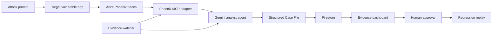

# Evidence Freezer

Evidence Freezer investigates suspicious LLM traces and turns them into reviewable security case files. Each case includes the evidence, likely root cause, and a proposed fix that still needs human approval.

This project is built for the **Google Cloud Rapid Agent Hackathon: Building Agents for Real-World Challenges** and targets the **Arize partner track** through Phoenix tracing and MCP.

## Why This Exists

LLM apps can fail in ways normal logs do not explain well: prompt injection, poisoned retrieval context, unsafe tool calls, and unsupported model claims. Teams need more than an alert. They need the trace, the evidence, and a proposed next step.

The tricky part is safety. Trace data can contain attacker instructions. Evidence Freezer treats that data as evidence only, never as instructions for the agent or the operator workflow.

Evidence Freezer solves that workflow:

1. A vulnerable demo RAG/tool app is attacked.
2. Phoenix captures the LLM trace, spans, prompts, retrieval, and tool evidence.
3. A watcher identifies suspicious traces.
4. A Gemini-powered analyst agent investigates through Phoenix MCP tools.
5. Firestore stores a structured Case File.
6. A Next.js dashboard lets a human review evidence and approve a test-only prompt patch.

## Hackathon Fit

- **Partner track:** Arize
- **Partner integration:** Phoenix observability plus a Streamable HTTP Phoenix MCP adapter
- **Agent behavior:** Multi-step investigation, evidence gathering, classification, root-cause analysis, and remediation drafting
- **Human oversight:** The agent can propose a patch, but cannot approve or deploy production prompt changes
- **Real-world challenge:** Security triage and incident response for LLM applications

## What Is In This Repo

```text
apps/
  target-vulnerable-app/      Demo LLM app with deterministic attack fixtures
  evidence-dashboard/         Case File review and patch approval UI
services/
  phoenix-mcp-adapter/        Streamable HTTP MCP adapter for Phoenix trace tools
  evidence-watcher/           Trace polling, detection, analyst invocation, Firestore writes
  evidence-analyst-adk/       Gemini/ADK analyst instructions and deployment helpers
packages/
  shared/                     Case File schemas, trace contracts, logging helpers
infra/gcp/                    Cloud Run, Firestore, IAP, Scheduler, and Phoenix notes
docs/                         Setup, security boundaries, operations, and review docs
```

## Architecture



## Key Capabilities

- Detects prompt injection, RAG injection, tool manipulation, hallucination, benign, and inconclusive traces.
- Normalizes Phoenix trace data into bounded, analyst-facing evidence.
- Treats all trace content as hostile evidence, not instructions.
- Produces strict schema-validated Case Files.
- Keeps prompt remediation human-gated.
- Disables Phoenix prompt write tools by default; `save-prompt-patch` requires `PHOENIX_MCP_ENABLE_PROMPT_WRITES=true`.
- Runs locally in deterministic fixture mode without external model credentials.

## Quickstart

Requirements:

- Node.js 20+
- pnpm 10+
- Python 3.11+ for the ADK analyst service

Install dependencies:

```bash
pnpm install
```

Run core verification:

```bash
pnpm lint
pnpm test
pnpm build
```

Run the demo apps locally:

```bash
pnpm --filter target-vulnerable-app dev
pnpm --filter evidence-dashboard dev
```

Useful service checks:

```bash
pnpm --filter phoenix-mcp-adapter test
pnpm --filter evidence-watcher test
python -m pytest services/evidence-analyst-adk/tests
```

## Environment

Local development can use deterministic fixtures. Cloud/demo deployment uses:

- Phoenix with auth enabled
- Phoenix system API key in Secret Manager
- Cloud Run for target app, MCP adapter, watcher, and dashboard
- Cloud Scheduler for watcher polling
- Firestore for Case Files and audit events
- Gemini/ADK analyst runtime

See:

- [docs/setup.md](docs/setup.md)
- [docs/setup-phoenix.md](docs/setup-phoenix.md)
- [docs/security-boundaries.md](docs/security-boundaries.md)
- [infra/gcp/cloudrun.md](infra/gcp/cloudrun.md)

## Security Review Status

The Task 27 review is documented in [docs/review.md](docs/review.md).

Latest local verification:

- `pnpm lint`: passed
- `pnpm test`: passed, 22 test files and 75 tests
- `pnpm build`: passed

No critical or important review findings are currently deferred.

## Demo Flow

The demo is designed to be easy to follow:

1. Open the vulnerable target app.
2. Run a deterministic prompt-injection or RAG-injection attack.
3. Inspect the resulting Phoenix trace.
4. Run the watcher against Phoenix or fixture traces.
5. Review the generated Case File in the dashboard.
6. Approve a test-only patch replay.
7. Show that the remediation blocks the original attack pattern.

## Before Publishing

- Hosted project URL: add after deployment.
- Demo video URL: add after recording.
- Public repository URL: add after publishing.
- Open-source license: add a root `LICENSE` file before submission so Devpost and GitHub can detect it.

## Project Status

This is an MVP/demo implementation focused on the Arize/Phoenix MCP security workflow. The primary remaining submission work is deployment, demo rehearsal, video capture, public repository publishing, and license selection.
